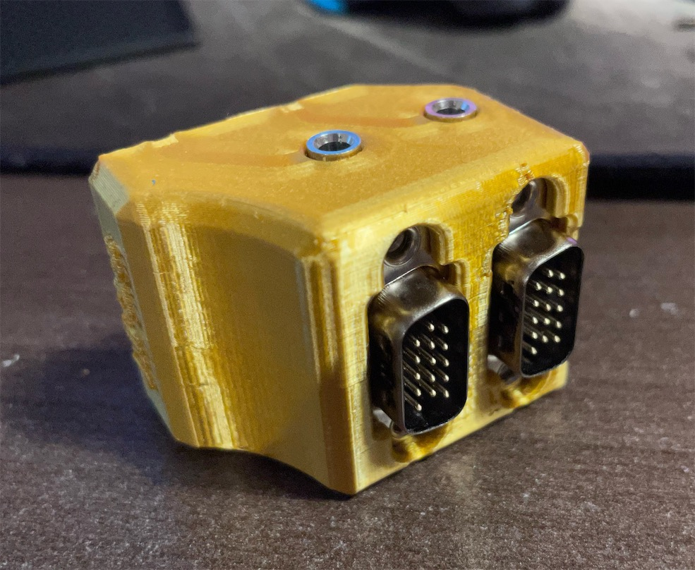
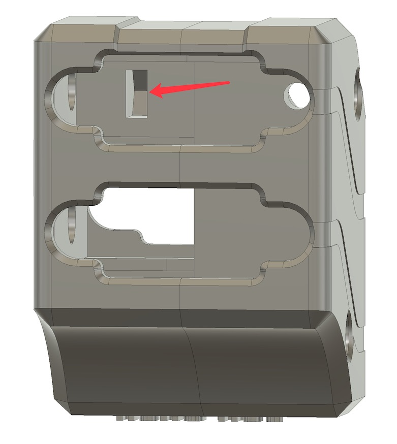
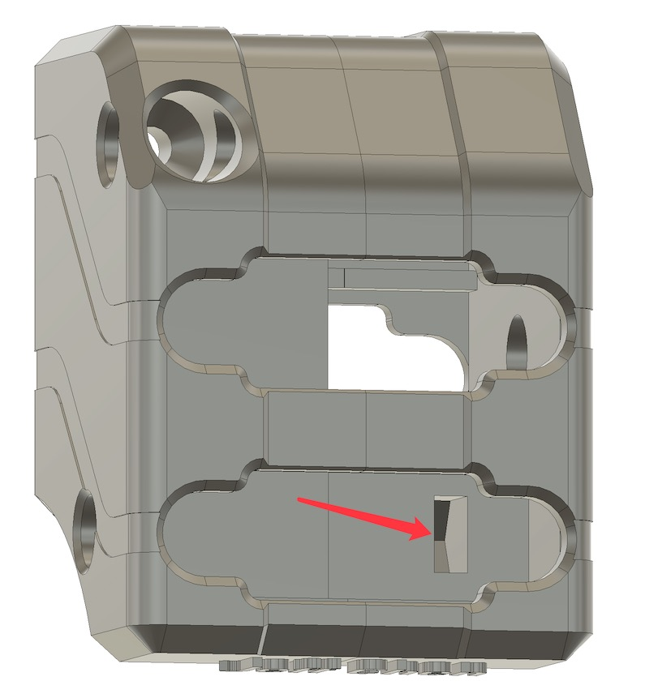
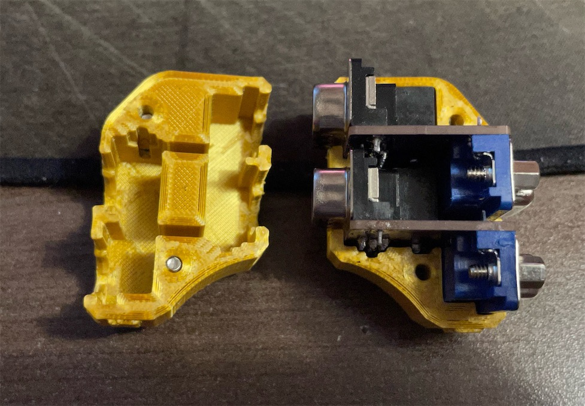

# MVX-Audio-Separator-Combiner
An Audio Signal Separator & Combiner for the Extron MVX Switch

This is a dongle for separating and combining audio from/into VGA pin 12 and 15 and output from a 3.5mm jack, in order to interface with the Extron MVX VGA switch.

It's only necessary when you transmit audio through the VGA cable into/out of the Extron MVX switch.

-------

## Parts

Here are the necessary parts:

VGA Female Slim
- https://www.aliexpress.com/item/4000596805684.html

VGA Male Slim (DigiKeyt Part No. L717HDE15PD4CH4R-ND)
- https://www.digikey.ca/en/products/detail/amphenol-icc-commercial-products/L717HDE15PD4CH4R/4886543

3.5mm Audio Jack (PJ-325), choose one
- https://www.digikey.com/en/products/detail/cui-devices/SJ1-3535N/738696
- https://www.aliexpress.com/item/1005002983859846.html

M3x20mm screw & nut
- https://www.amazon.com/gp/product/B014OO5KQG

Thumb Screw
- https://www.aliexpress.com/item/4000822559291.html

PCB - 2 PCB per assembly (Gerber file also available)
- https://oshpark.com/shared_projects/5r6jeMxH

3D Printed Shells

-------

## Assembly

Solder the VGA ports according to the silk screen print. Make sure the ports sit tightly on top of the PCB. Solder two copies of the PCB assembly. Make sure to trim the extra length of the pins of the audio jack for the upper assembly, or it will interfere with the bottom assembly.

Insert two nuts into the slot inside the right shell

Insert the two PCB assembly into the right shell

Close the left shell onto the right. Then screw in the two M3x20 screws. Do not over tighten the screws, or the nuts would break free inside the slots.

Last, screw in the thumb screw.

-----

## Misc
Due to the space restriction behind the MVX switch, you will need a audio jumper cable with both ends in a right angle for clearance. Here is an example:
- https://www.aliexpress.com/item/4000465962340.html
